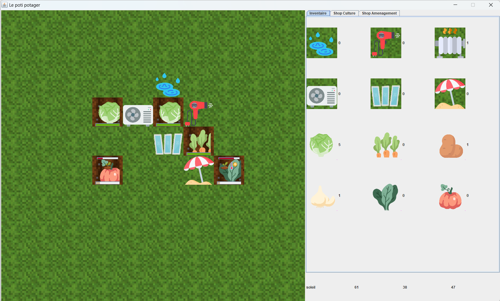
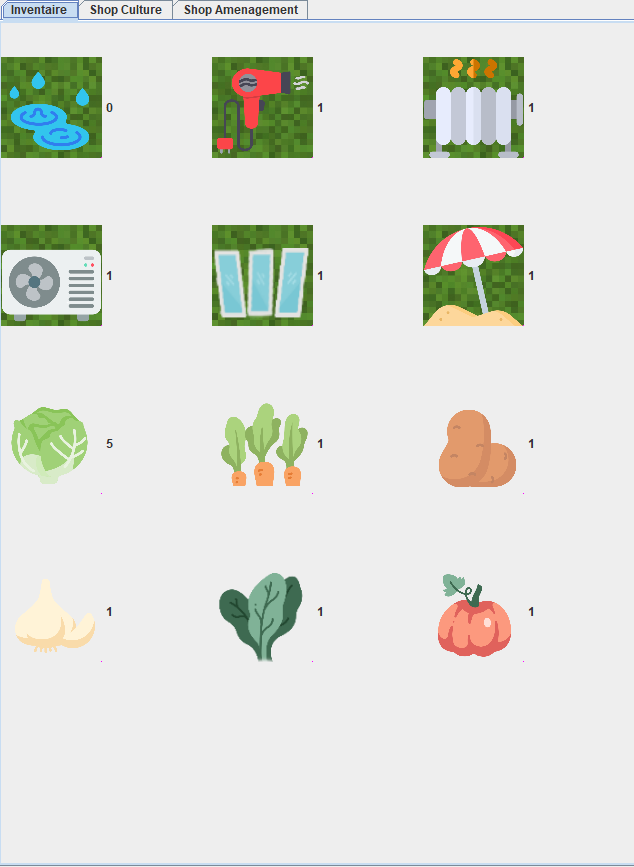
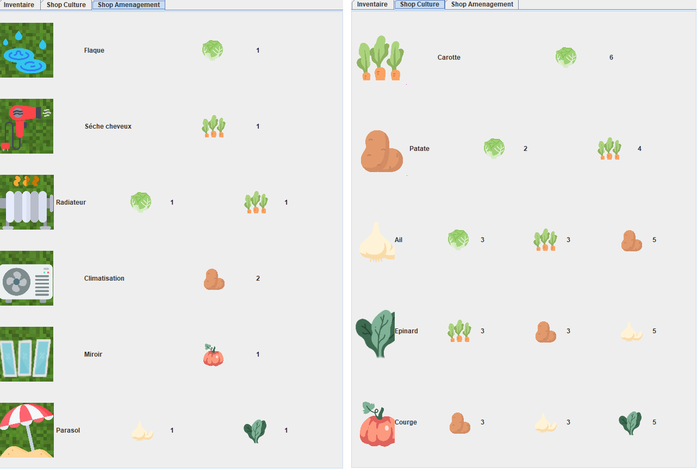
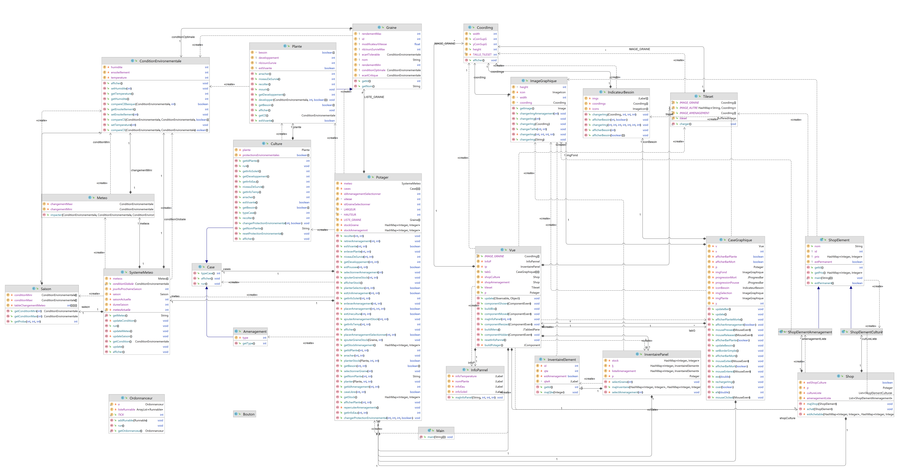

# Jeux simulateur de potager

Ce projet de cours vise à implémenter un petit jeu de gestion d'un potager en utilisant Java et sa bibliothèque graphique Swing.

## Fonctionnalités

### Gestion du potager

Le potager se compose d'une grille 10x10 dans laquelle on peut planter différentes plantes.
Les plantes présentes dans le potager poussent si les conditions nécessaires à leur développement sont réunies. Sinon elles dépérissent lentement avant de mourir.

### Météo
La météo et les besoins des plantes sont simulés selon 3 paramètres : l’Humidité, l’Ensoleillement
et la Température, allant de 1 à 100.

Les plantes possèdent des conditions idéales de pousse et un écart toléré, si la météo sort de
cet écart, la plante arrête de pousser et commence à mourir d’une des 6 causes suivantes : 
trop chaud, trop froid, trop d’eau, sécheresse, manque de soleil, trop de soleil

Chaque jour, ces 3 paramètres sont modifiés en fonction du temps (soleil, nuage, pluie ou neige) et
de la saison :
- temps : défini si les valeurs augmentent ou diminuent (pluie : humidité ++,ensoleillement-…)
- saison : définit les valeurs minimum et maximum des paramètres (ex : 40<ensoleillement<95 en été)
- définit aussi les probabilités de passer d’un temps à l’autre.

Le temps évolue lui aussi tous les jours en suivant une chaine de Markov qui définit la probabilité de passer d'un temps à l'autre en fonction de la saison.

### Aménagement
Pour permettre au joueur de ne pas simplement subir la météo, nous avons mis en place un système d’aménagement qui protège les plantes des excès de la météo, sur les 8 cases adjacentes.

Les aménagements peuvent s’acheter dans la boutique et sont stockés dans l’inventaire.
Pour poser un aménagement, il faut le sélectionner dans l’inventaire et le placer avec un clic droit, il peut ensuite être récupéré avec un clic gauche

### Inventaire

A la droite de l’écran on retrouve 3 onglets, le premier est consacré à l’inventaire du joueur.

On y trouve tous les stocks du joueur :
- Les légumes
- Les aménagements

En cliquant sur un légume ou un aménagement, le joueur sélectionne ce dernier et peut ensuite le placer dans le potager.

### Boutique

Les 2 derniers onglets de la partie droite de l’écran sont consacrés à une boutique où le joueur peut acheter des légumes et des aménagements à partir des légumes qu'il possède dans son inventaire.

Acheter une culture plus avancée demande des cultures précédentes par exemple :
- 1 carotte coûte X salade
- 1 patate coûte X carotte et X salade

Cette fonctionnalité permet d'instaurer une progression et de donner un but au jeu (posséder toutes les cultures)

## Implémentation

### Diagramme de classe

### Interface graphique
L'interface graphique du jeu est isolé de la logique en suivant le principe MVC.

Elle est implémentée avec la bibliothèque graphique de Java, Swing.

La JFrame principale est divisée en trois parties (potager, interface inventaire / Shop et informations)

Le potager utilise plusieurs composants complexes :
- Un GridbagLayout de JLayeredPane, pour modéliser le potager.
- Chaque case utilise un JLayeredPane qui permet d’empiler les couches :
  1. fond (terre ou herbe)
  2. plante/aménagement
  3. barres de progressions (de pousse et/ou de mort)
  4. icône de besoin de la plante (des 6 facteurs de risques expliqués dans météo)
- Un TabbedPane pour les interfaces inventaire et Shop, qui permet d'avoir plusieurs JPanel
sur un même endroit et de naviguer entre chaque avec des onglets.
- Un InfoPanel, un panel dynamique qui donne selon où notre curseur se trouve:
  - soit la météo actuelle (sur une case vide)
  - soit les besoins d'une plante (sur une case ou il y a une plante)